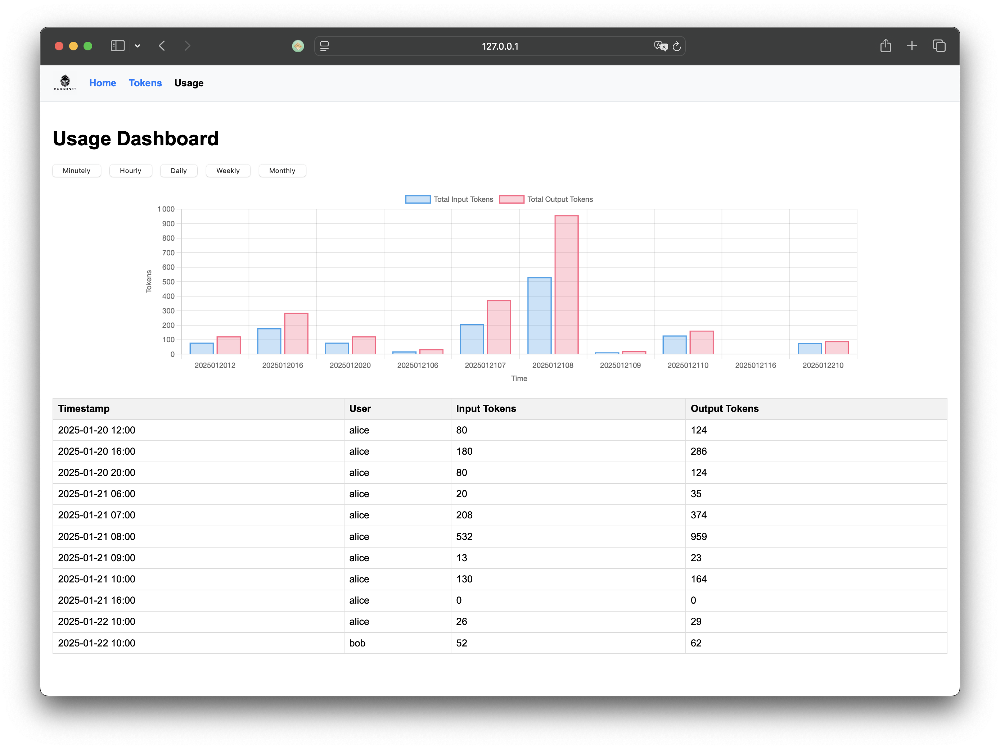

# Burgonet - AI Enterprise Gateway

<p align="center">
  
</p>

**AI enterprise gateway** implemented in Rust 🦀 that provides secure access to LLM and compliance controls for AI systems.
It will help organizations to manage their **AI governance** in a secure and compliant way.

The goal is to provide for employees, unit and project access to
cloud based LLM providers or self-hosted models via that single entrypoint.

<p align="center">
  
</p>


## Features

- 🔑 **Token Management**: Generate, view, and delete API tokens
- 🎯 **Quota Management**: Set token quotas per user, group or project
- 📊 **Usage Monitoring**: Real-time usage tracking and analytics
- 🤖 **Provider Management**: Configure multiple LLM providers (OpenAI, Claude, DeepSeek, Ollama, etc.)
- ⏱️ **Rate Limiting**: Built-in rate limiting with configurable thresholds
- 📝 **Audit Logs**: Detailed logging of API requests and responses
- 🖥️ **Embedded Web UI**: Built-in admin interface for configuration and monitoring
- 🔒 **PII Protection**: Built-in Personally Identifiable Information detection and blocking
- 📈 **Prometheus Metrics**: Built-in Prometheus endpoint for monitoring and alerting
- 🔐 **Trusted Header Authentication**: Support for authentication via trusted HTTP headers
- 🚫 **Content Filtering**: Block requests containing blacklisted words (e.g. "confidential")
- 🚷 **Group Access Control**: Restrict access by user groups with disabled_groups configuration

Need another feature? Don't hesitate to [send an email](mailto:sebastien.campion@foss4.eu) or [create a GitHub ticket](https://github.com/burgonet-eu/gateway/issues)!


## Documentation 

The complete documentation is available at [https://burgonet.eu/](https://burgonet.eu/)

## Quickstart 

Download the binary in the [packages](https://github.com/burgonet-eu/gateway/releases/) and the configuration file [conf.yml](conf.yml) file,  run it : 

    ./burgonet-gw -c conf.yml 


Open in your browser the URL [http://127.0.0.1:6189/](http://127.0.0.1:6189/)



## Configuration 

The configuration file `conf.yml` is used to define the models, the quotas, the providers, the tokens, the rate limits, 
the groups, the PII protection, the blacklisted words and the Prometheus metrics.

Here is an example of part of a configuration file:
```yaml
models:
  - location: "/echo/chat/completions"
    model_name: "echo"
    proxy_pass: "http://localhost:9999"
    api_key: "$DEEPSEEK_API_KEY"
    parser: "ollama"
    disabled_groups: "mammals, birds"
    blacklist_words: "confidential, mycorp"
    pii_protection_url: "http://127.0.0.1:8001/check-pii-base64"
    quotas:
      - max_tokens:
          minute: 500
          hour: 6000
          day: 10000
          week: 40000
      - max_requests:
          second: 1
          minute: 15
```

Here is an example of a curl request to the gateway:

```bash
curl -X POST http://localhost:6189/echo/chat/completions \
  -H "Authorization: Bearer YOUR_API_KEY" \
  -H "Content-Type: application/json" \
  -d '{
    "model": "echo",
    "messages": [{"role": "user", "content": "Bonjour le monde"}]
  }'
```


## License

This project is provided under the Commons Clause License Condition v1.0 (see [LICENSE](LICENSE) file for details) and follows the [Fair-code](https://faircode.io) principles.
The license allows free non-production use. For commercial use or production deployments, please contact the author to discuss licensing options.

## Author  

Sébastien Campion - sebastien.campion@foss4.eu


## Name origin 

The [burgonet (wikipedia)](https://en.wikipedia.org/wiki/Burgonet) is an ancient helmet, it's a protection for the brain.
Protect your knowledge 
